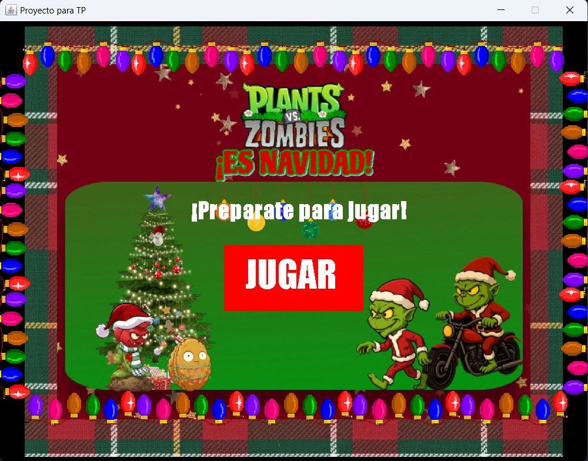
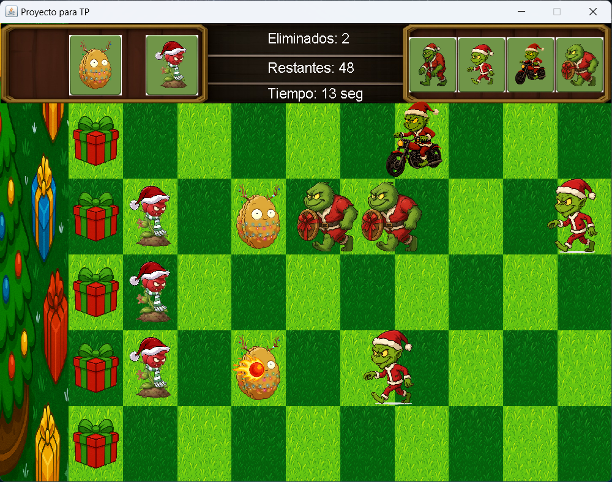
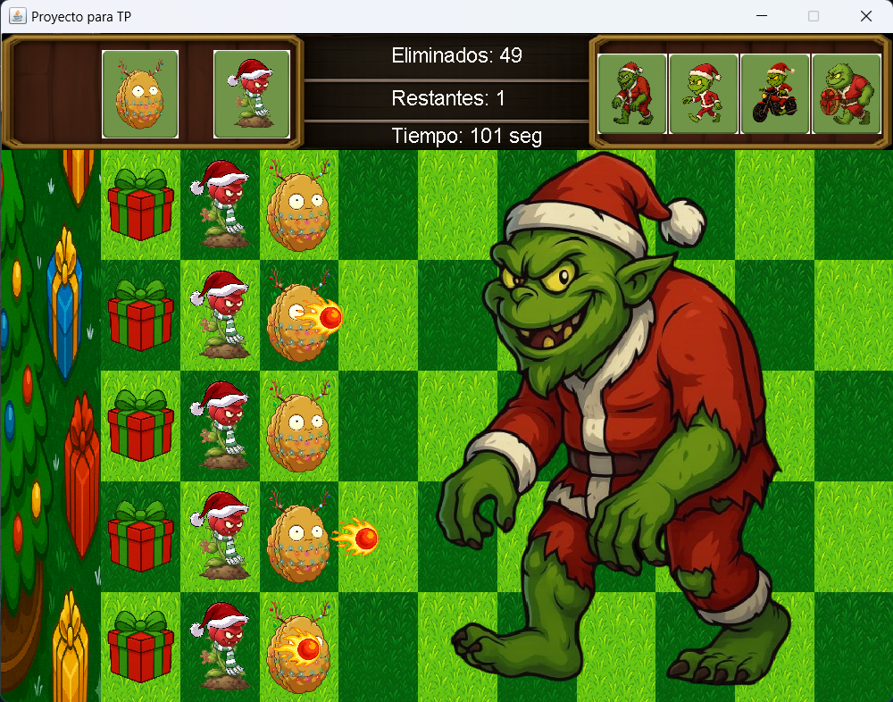

# 🧟‍♂️ La Invasión de los Zombies Grinch

Recreación del clásico Plantas vs Zombies desarrollado en Java como trabajo práctico final de Programación I (UNGS).

El jugador debe defender los regalos del ataque de los Zombies Grinch colocando plantas estratégicamente en el tablero.

---

## 🎮 Características principales

- Tablero de 5 filas donde se colocan plantas
- Sistema de cartas con tiempo de recarga
- Movimiento de plantas dentro del tablero
- Distintos tipos de zombies (rápido, resistente, colosal)
- Sistema de proyectiles y colisiones
- Condiciones de victoria y derrota

---

## 🖼️ Capturas

---

## 🛠️ Tecnologías

- Java
- Entorno gráfico provisto por la cátedra
- Programación orientada a objetos
- Eclipse

---

## 📚 Aprendizajes

- Diseño de clases y objetos
- Manejo de colisiones
- Lógica de juegos
- Organización de código en paquetes
- Trabajo con GitHub

---

## 🎓 Contexto académico

Proyecto desarrollado como trabajo práctico final de la materia **Programación I** en la Universidad Nacional de General Sarmiento (UNGS).
